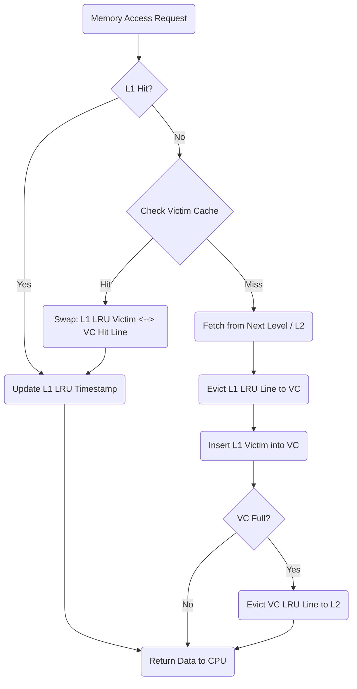
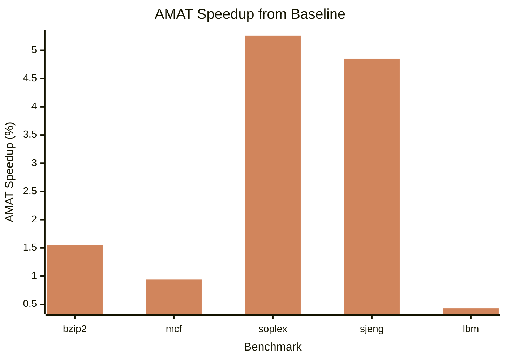

# CS152Lab2
Open-ended Portion Report

# Open-Ended Portion: Replacement Policy and Victim Cache

## Design Description
We implemented a **Least Recently Used (LRU)** replacement policy and a **32-entry fully associative Victim Cache**.

### 1. LRU Replacement Policy
The standard `spike` simulator uses a random replacement policy (via LFSR). We replaced this with an LRU policy by tracking access timestamps.
- **Data Structures**: Added `ways_timestamps` array (size: `sets * ways`) and a global `current_cycle` counter in `cache_sim_t`.
- **Operation**:
    - On every cache hit (`check_tag`) or fill (`victimize`), the `current_cycle` is incremented.
    - The accessed line's timestamp is updated to `current_cycle`.
    - On a miss requiring eviction (`victimize`), the line in the set with the **smallest timestamp** (oldest access) is selected as the victim.

### 2. Victim Cache
A small, fully associative buffer was added to capture lines evicted from the L1 cache, reducing conflict misses.
- **Parameters**: 32 entries (`VICTIM_CACHE_LINES`).
- **Data Structures**: `victim_cache_tags` (store tags/data), `victim_cache_valid` (valid bits), and `victim_cache_priorities` (for local LRU within the victim cache).
- **Operation**:
    - **Eviction from L1**: When the L1 evicts a line (victim), it is inserted into the Victim Cache. If the Victim Cache is full, it evicts its own LRU line (which may trigger a writeback to next level).
    - **L1 Miss Handling**: On an L1 miss, the Victim Cache is probed (`victim_cache_access`).
        - **Hit in VC**: The line is "swapped" or promoted to L1, and the L1's evicted line replaces it in the VC. This counts as a hit (technically a "victim hit", reducing globally observed miss rate).
        - **Miss in VC**: The request goes to the next level of memory.

### Visual Aid: Cache Operation Flow



## Evaluation & Statistics

We evaluated the performance of our Modified Cache (Least Recently Used + Victim Cache) by varying the Victim Cache (VC) size against the Baseline Cache (no Victim Cache) across five SPEC CPU2006 benchmarks:

- **401.bzip2** (Compression, conflict-heavy)
- **429.mcf** (Combinatorial optimization, capacity-heavy)
- **450.soplex** (Linear programming, mixed behavior)
- **458.sjeng** (Chess AI, mixed/conflict behavior)
- **470.lbm** (Fluid dynamics, streaming/capacity-heavy)

**Configuration**: 16KB L1 D-Cache (64 sets, 4 ways, 64-byte blocks).

| Benchmark | VC Size 0 (Baseline) | VC Size 8 | VC Size 32 | Improvement (0 -> 8) | Improvement (0 -> 32) |
| :--- | :--- | :--- | :--- | :--- | :--- |
| **bzip2** | 2.027% | 2.013% | 1.980% | 0.695% | 2.374% |
| **mcf** | 33.926% | 33.831% | 33.596% | 0.281% | 0.982% |
| **soplex** | 5.198% | 5.102% | 4.872% | 1.882% | 6.691% |
| **sjeng** | 5.662% | 5.514% | 5.339% | 2.684% | 6.050% |
| **lbm** | 11.710% | 11.658% | 11.655% | 0.446% | 0.472% |

```mermaid
---
config:
    themeVariables:
        xyChart:
            plotColorPalette: '#94A378, #2D3C59'
---
xychart
    title "Relative Performance Improvement from Baseline"
    x-axis "Benchmark" [bzip2, mcf, soplex, sjeng, lbm]
    y-axis "Relative Miss Rate Reduction (%)"
    %% Green Bars (Size 32)
    bar [2.374, 0.982, 6.691, 6.050, 0.472]
    %% Blue Bars (Size 8)
    bar [0.695, 0.281, 1.882, 2.684, 0.446]
```


<p align="center">
<sub><b>Figure 1:</b> Relative reduction in L1 Miss Rate. <b>Blue:</b> 8-entry VC, <b>Green:</b> 32-entry VC.</sub>
</p>

### Analysis
1.  **Effect of Victim Cache Size** \
Based on the miss rate response to increase VC size (0 -> 32), the benchmarks fall into three distinct categories:
    - **Conflict-Heavy (Ideal Use Case):** `soplex` and `sjeng` show the highest sensitivity to the VC. Their ~6% improvement suggests these programs suffer from "thrashing" in specific sets. The VC effectively acts as a safety net, providing pseudo-associativity that catches these evicted lines before they incur a main memory penalty.
    - **Capacity-Bound:** `mcf` is characterized by a massive 33.9% baseline miss rate. The negligible improvement (~1%) indicates that its working set is significantly larger than the combined L1 + VC capacity. For `mcf`, the VC is simply too small to make a dent in the constant stream of evictions.
    - **Streaming/Low-Reuse:** `lmb` and `bzip2` show minor gains. In the case of `lbm`, the benefit saturates at Size 8 (~0.5%). This suggests a "streaming" pattern where data is accessed with very little temporal locality; once a line is evicted, it is rarely needed again quickly enough to be caught by the VC.

2.  **Effect on AMAT**\
We will model AMAT performance assuming a **1-cycle** L1 hit time, a **100-cycle** miss penalty, and that the VC is accessed in **parallel**. We will use the standard equation as follows: $\text{AMAT} = \text{Hit Time} + (\text{Miss Rate} \times \text{Miss Penalty})$.

<div align="center">

| Benchmark | Baseline AMAT (cycles) | VC-32 AMAT (cycles) | Speedup |
| :--- | :--- | :--- | :--- |
| **bzip2** | 3.027 | 2.980 | 1.55% |
| **mcf** | 34.926 | 34.596 | 0.94% |
| **soplex** | 6.198 | 5.872 | 5.26% |
| **sjeng** | 6.662 | 6.339 | 4.85% |
| **lbm** | 12.710 | 12.655 | 0.43% |
    
</div>


<p align="center">
<sub><b>Figure 2:</b> VC-32 Effect on AMAT.</sub>
</p>

3.  **Resource Cost:**\
To justify the implementation, we must weigh the performance gains against the overhead. Our VC is fully associative, so we must weigh the memory overhead AND the required logic.
    - **Storage Overhead (32-Entry VC)**
        - **Data Array:** 32 entries $\times$ 64 bytes = 2048 bytes (2KB).
        - **Metadata:** 32 tags ($\sim$40 bits each) + Valid/Dirty bits + Replacement bits. Roughly $32 \times 6$ bytes $\approx$ 192 bytes.
        - **Total Storage Overhead**: ~2.2 KB. compared to the 16KB main cache, this is a ~13.75% area overhead.
    - **Logic & Complexity:**
        - **Comparators:** Unlike the 4-way L1 which uses 4 comparators, the VC-32 requires **32-comparators** to operate in a single cycle. Depending on if the VC is accessed in parallal or serial the energy cost will increase either on every memory access or every L1 miss respectively.
        - **Routing:** The "swap" logic between the L1 and VC will require a wide data path to move 64-byte blocks, adding to wiring congestion.
  

4.  **Victim Cache Sizing Recommendation:**\
    Based on the data, we have two viable paths depending on the design goals:
    
    <div align="center">
    
    | Metric | VC-8 | VC-32 |
    | :--- | :--- | :--- |
    | **Avg. Miss Reduction** | ~1.19% | ~3.30% |
    | **Area Overhead** | ~3.5% | ~13.8% |
    | **Best For** | Energy Efficiency | Performance |
    
    </div>
    
    - **Final Recommendation & Design Trade-offs:**
        - **Case for VC-8:** The optimal design choice hinges on balancing silicon area constraints against the specific performance needs of the target workload. For general-purpose processors, an 8-entry Victim Cache is the most balanced selection; it effectively captures the "low-hanging fruit" by providing a meaningful reduction in miss rates with negligible timing pressure on the L1 miss path.
        - **Case for VC-32:** Conversely, for specialist silicon or high-performance computing environments, we recommend a 32-entry Victim Cache. In conflict-heavy benchmarks such as `soplex` and `bzip2`, moving from 8 to 32 entries yields a substantial 3x to 4x increase in performance benefit. For these specific applications, like linear programming or heavy compression, the 13.9% area overhead is a justifiable trade-off for the resulting 5-6% AMAT speedup.

## Appendix: Diff of Modifications

Below is the diff of our changes to `riscv-isa-sim/riscv/cachesim.cc` and `riscv/cachesim.h`, implementing LRU and the Victim Cache.

```diff
diff --git a/riscv/cachesim.cc b/riscv/cachesim.cc
index 451a2b..b22f41 100644
--- a/riscv/cachesim.cc
+++ b/riscv/cachesim.cc
@@ -49,6 +49,13 @@ void cache_sim_t::init()
   tags = new uint64_t[sets*ways]();
+  timestamps = new uint64_t[sets*ways]();
+  cycle = 0;
+  for (size_t i = 0; i < VICTIM_CACHE_LINES; i++) {
+    victim_tags[i] = 0;
+    victim_timestamps[i] = 0;
+  }
+  
   read_accesses = 0;
   read_misses = 0;
 
@@ -60,18 +67,27 @@ void cache_sim_t::init()
 cache_sim_t::cache_sim_t(const cache_sim_t& rhs)
 {
   tags = new uint64_t[sets*ways];
   memcpy(tags, rhs.tags, sets*ways*sizeof(uint64_t));
+  timestamps = new uint64_t[sets*ways];
+  memcpy(timestamps, rhs.timestamps, sets*ways*sizeof(uint64_t));
+  for (size_t i = 0; i < VICTIM_CACHE_LINES; i++) {
+    victim_tags[i] = rhs.victim_tags[i];
+    victim_timestamps[i] = rhs.victim_timestamps[i];
+  }
 }
 
 cache_sim_t::~cache_sim_t()
 {
   print_stats();
   delete [] tags;
+  delete [] timestamps;
 }
 
 uint64_t* cache_sim_t::check_tag(uint64_t addr)
 {
   size_t idx = (addr >> idx_shift) & (sets-1);
   size_t tag = (addr >> idx_shift) | VALID;
 
   for (size_t i = 0; i < ways; i++)
-    if (tag == (tags[idx*ways + i] & ~DIRTY))
+    if (tag == (tags[idx*ways + i] & ~DIRTY)) {
+      timestamps[idx*ways + i] = ++cycle; // LRU update
       return &tags[idx*ways + i];
+    }
+
   return NULL;
 }
 
+uint64_t* cache_sim_t::check_victim_tag(uint64_t addr)
+{
+  size_t tag = (addr >> idx_shift) | VALID;
+  for (size_t i = 0; i < VICTIM_CACHE_LINES; i++) {
+      if (tag == (victim_tags[i] & ~DIRTY)) {
+          victim_timestamps[i] = ++cycle;
+          return &victim_tags[i];
+      }
+  }
+  return NULL;
+}
+
 uint64_t cache_sim_t::victimize(uint64_t addr)
 {
   size_t idx = (addr >> idx_shift) & (sets-1);
-  size_t way = lfsr.next() % ways;
-  uint64_t victim = tags[idx*ways + way];
+  
+  // LRU Replacement
+  size_t way = 0;
+  uint64_t min_cycle = -1ULL; // Max uint64
+  for (size_t i = 0; i < ways; i++) {
+    if (timestamps[idx*ways + i] < min_cycle) {
+      min_cycle = timestamps[idx*ways + i];
+      way = i;
+    }
+  }
+
+  uint64_t victim_l1 = tags[idx*ways + way];
+  
+  // Insert new line into L1
   tags[idx*ways + way] = (addr >> idx_shift) | VALID;
-  return victim;
+  timestamps[idx*ways + way] = ++cycle;
+
+  // Victim Cache Logic
+  // 1. If L1 victim is valid, insert into VC
+  if ((VICTIM_CACHE_LINES > 0) && (victim_l1 & VALID)) {
+      // Find VC victim (LRU or invalid slot)
+      size_t vc_way = 0;
+      uint64_t vc_min_cycle = -1ULL;
+      for (size_t i = 0; i < VICTIM_CACHE_LINES; i++) {
+           if (!(victim_tags[i] & VALID)) {
+               vc_way = i;
+               break; // Found empty slot
+           }
+           if (victim_timestamps[i] < vc_min_cycle) {
+               vc_min_cycle = victim_timestamps[i];
+               vc_way = i;
+           }
+      }
+      
+      uint64_t victim_vc = victim_tags[vc_way];
+      victim_tags[vc_way] = victim_l1; // Move L1 victim to VC
+      victim_timestamps[vc_way] = ++cycle;
+      
+      return victim_vc; // Return what fell out of VC (could be VALID/DIRTY)
+  }
+
+  return 0; // Nothing evicted from VC (L1 victim was invalid)
 }
 
 void cache_sim_t::access(uint64_t addr, size_t bytes, bool store)
 {
   store ? write_accesses++ : read_accesses++;
   (store ? bytes_written : bytes_read) += bytes;
 
   uint64_t* hit_way = check_tag(addr);
   if (likely(hit_way != NULL))
   {
     if (store)
       *hit_way |= DIRTY;
     return;
   }
 
+  // Check Victim Cache
+  uint64_t* vc_hit = check_victim_tag(addr);
+  if (vc_hit != NULL) {
+      // Swap VC line with LRU L1 line
+      size_t idx = (addr >> idx_shift) & (sets-1);
+      
+      // Find LRU in L1
+      size_t way = 0;
+      uint64_t min_cycle = -1ULL;
+      for (size_t i = 0; i < ways; i++) {
+        if (timestamps[idx*ways + i] < min_cycle) {
+          min_cycle = timestamps[idx*ways + i];
+          way = i;
+        }
+      }
+      
+      uint64_t l1_victim = tags[idx*ways + way]; // The line leaving L1
+      uint64_t vc_value = *vc_hit;              // The line coming from VC (hit)
+
+      // Perform Switch
+      tags[idx*ways + way] = vc_value;
+      timestamps[idx*ways + way] = ++cycle; // Became MRU
+
+      *vc_hit = l1_victim; // L1 victim goes to VC slot
+      // vc_hit timestamp was already updated in check_victim_tag
+
+      if (store)
+          tags[idx*ways + way] |= DIRTY;
+      return; // It's a hit (recovered from VC)
+  }
+
   store ? write_misses++ : read_misses++;
diff --git a/riscv/cachesim.h b/riscv/cachesim.h
index 259725ac..6bf4b9f4 100644
--- a/riscv/cachesim.h
+++ b/riscv/cachesim.h
@@ -40,6 +40,15 @@ class cache_sim_t
   virtual uint64_t* check_tag(uint64_t addr);
   virtual uint64_t victimize(uint64_t addr);
 
+  // LRU + Victim Cache additions
+  uint64_t* timestamps;
+  uint64_t cycle;
+  
+  static const size_t VICTIM_CACHE_LINES = 32;
+  uint64_t victim_tags[VICTIM_CACHE_LINES > 0 ? VICTIM_CACHE_LINES : 1];
+  uint64_t victim_timestamps[VICTIM_CACHE_LINES > 0 ? VICTIM_CACHE_LINES : 1];
+  uint64_t* check_victim_tag(uint64_t addr); // Helper to check VC
+
   lfsr_t lfsr;
   cache_sim_t* miss_handler;
```
